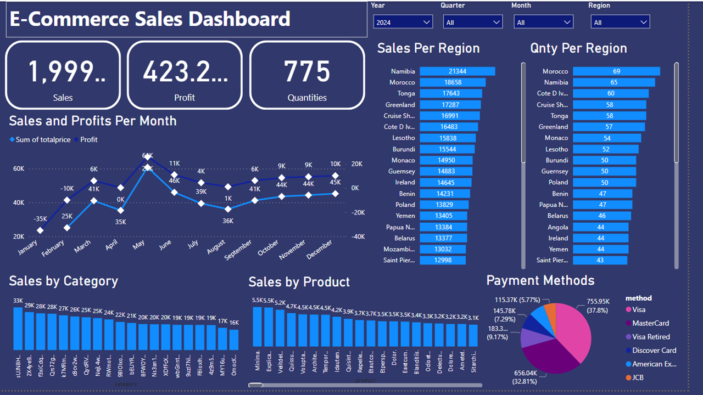
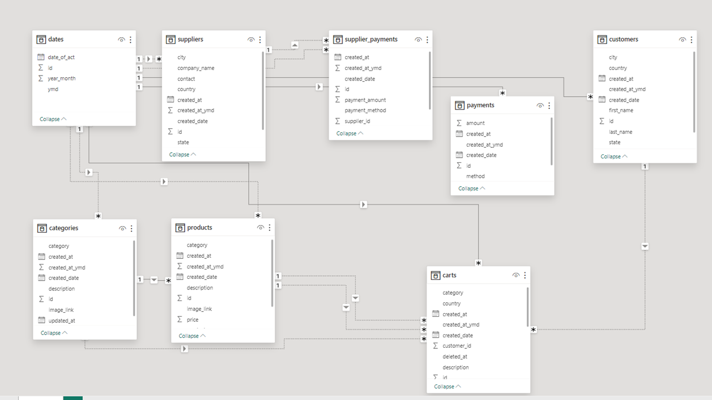

# Data Analysis Ecommerce Sales
------------------------------------------------------------------------------------------------------
Here are complete example of data transformation and cleaning using **R** and **Python** and 
Visualization using **PowerBI**.
The data is imported from MySQL Server, tranformed and displayed in PowerBI Dashboard.
To replicate with the same data, consider to use **e_commerce_db_dump.sql** file.
This project get data from the follow repository **https://github.com/josecome/e-commerce-laravel** in this account.

Dashboard screenshot

Data Model

## Status
Not yet completed!

